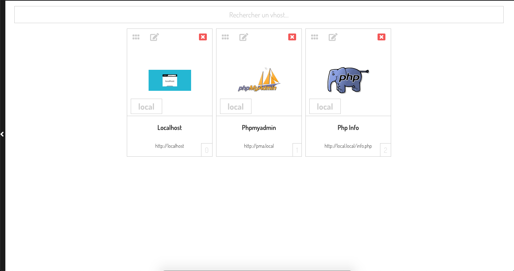
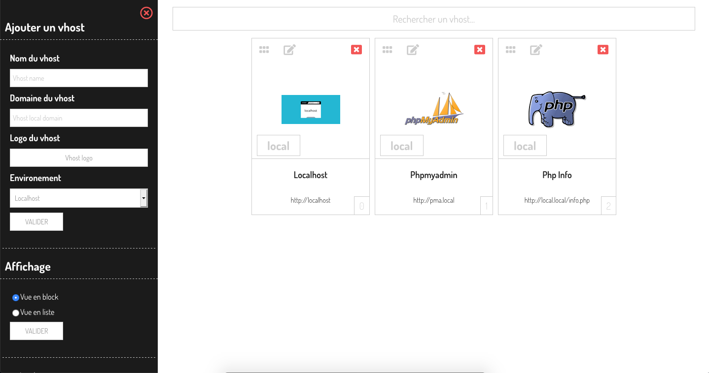
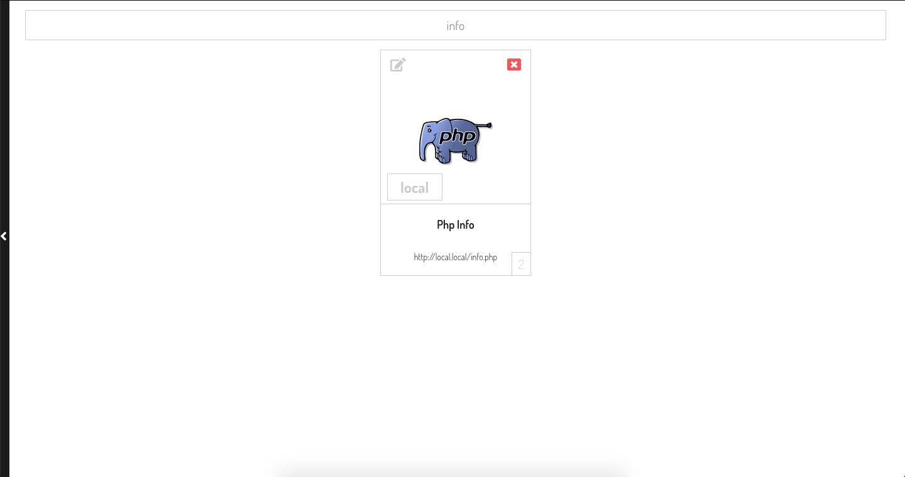
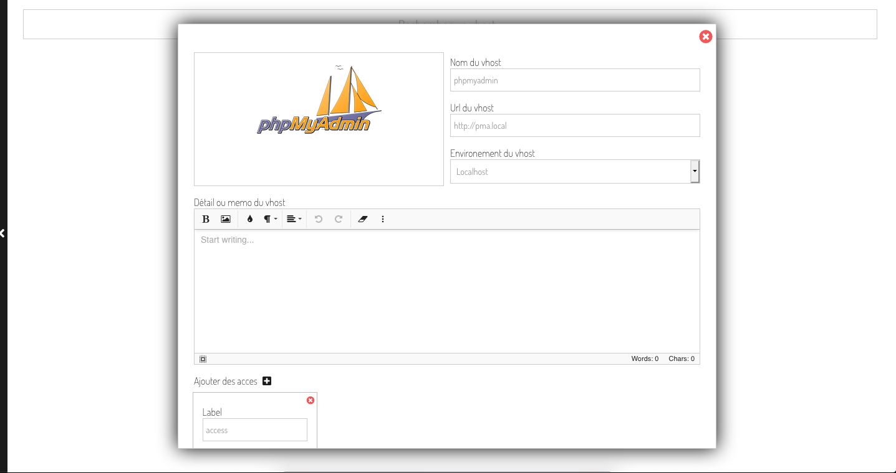

[](https://travis-ci.org/ben-antioco/dev-vhost-manager)
[](https://badge.fury.io/js/npm)

# dev-vhost-manager
Pour les développeur web : Gestion des vhosts dans le localhost


### Installation
Créer une base de données "local_db"
```sh
$ mysql -u dbusername -p

mysql> CREATE DATABASE IF NOT EXISTS local_db;

mysql> exit

$ cd chemin/vers/dev-vhost-manager/ && mysql -u dbusername -p local_db < sql/local_db.sql

```

Copier le fichier config.php.dist en config.php, renseigner les info de votre base de données
```sh
$ cp config.php.dist config.php
```


### Docker
```sh
$ make host

$ make du
```

A la fin de l'installation docker
```sh
$ make ddb

$ cd var/www/html && mysql -u dev -pdev dev < sql/local_db.sql
```

Acces à l'application
```sh
http://vhostmanager.local
```

Acces à phpmyadmin
```sh
http://vhostmanager.local:8181
```

### Apache - vhost.conf
```sh
<VirtualHost *:80>

    ServerAdmin root@email.local
    DocumentRoot "/your/dir/www/dev-vhost-manager"
    ServerName local.local
    ServerAlias local.local
    ErrorLog "/your/dir/www/httpd_logs/local.local-error_log"
    CustomLog "/your/dir/www/httpd_logs/local.local-access_log" common

    <Directory "/your/dir/www/dev-vhost-manager">
        AllowOverride All
        Require all granted
        Order allow,deny
        Allow from all
    </Directory>

</VirtualHost>
```

### Développement mode
```sh
$ cd dev-vhost-manager && make watch
```

### Production mode
```sh
$ cd dev-vhost-manager && make prod
```

### Installation manuelle

- Création d'une base de donnée local_db, importer sql/local_db.sql
- Copier config.php.dist et renommer la copie config.php, puis renseigner les paramètres de la base de donnée.
- npm run prod pour installer les dépendances JS.

### SCREENSHOT








